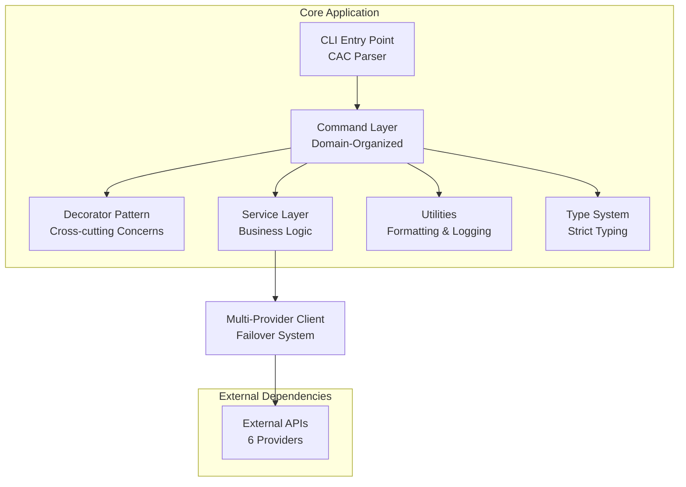
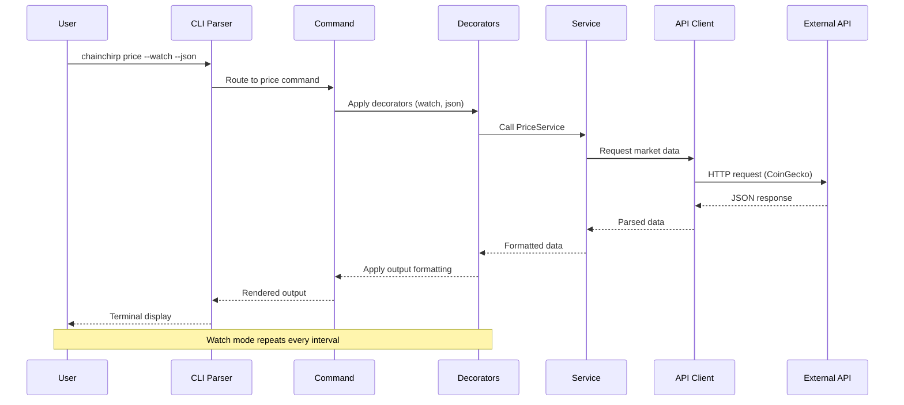
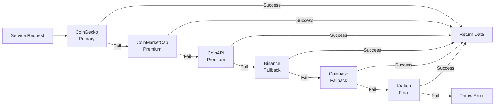

# Technical Architecture

**Deep dive into ChainChirp CLI's design, patterns, and implementation.**

## Overview

ChainChirp follows a clean, layered architecture designed for reliability, performance, and extensibility. The system is built with TypeScript and emphasizes type safety, modularity, and testability.



## Core Principles

### 1. Separation of Concerns
- **CLI Layer**: Argument parsing and command routing
- **Command Layer**: User interface and coordination
- **Service Layer**: Business logic and data processing
- **Client Layer**: External API communication

### 2. Reliability First
- **Multi-provider fallback**: 6 API providers with automatic failover
- **Comprehensive error handling**: Graceful degradation
- **Rate limiting**: Respect API constraints
- **Caching**: Reduce API calls and improve performance

### 3. Developer Experience
- **TypeScript**: Full type safety and IntelliSense
- **Consistent patterns**: Predictable code structure
- **Extensibility**: Easy to add new commands and features
- **Testing**: Comprehensive test coverage

## Request Flow



## Directory Structure

```
src/
├── index.ts                 # CLI entry point and command registration
├── commands/                # Command implementations
│   ├── market/             # Market data commands
│   │   ├── price.ts        # Price command implementation
│   │   ├── volume.ts       # Volume command
│   │   ├── change.ts       # Price changes
│   │   ├── highlow.ts      # High/low prices
│   │   └── sparkline.ts    # ASCII charts
│   ├── chain/              # Blockchain commands
│   │   ├── block.ts        # Block information
│   │   ├── mempool.ts      # Mempool status
│   │   ├── fees.ts         # Fee estimates
│   │   ├── hashrate.ts     # Network hashrate
│   │   └── halving.ts      # Halving countdown
│   └── decorators/         # Command decorators
│       ├── json.ts         # JSON output decorator
│       ├── watch.ts        # Watch mode decorator
│       ├── currency.ts     # Currency decorator
│       ├── help.ts         # Help decorator
│       └── version.ts      # Version decorator
├── services/               # Business logic layer
│   ├── apiClient.ts        # Multi-provider HTTP client
│   ├── market/             # Market data services
│   │   ├── priceService.ts
│   │   ├── volumeService.ts
│   │   └── ...
│   └── chain/              # Blockchain services
│       ├── blockService.ts
│       ├── feesService.ts
│       └── ...
├── utils/                  # Utilities and helpers
│   ├── formatter.ts        # Output formatting and styling
│   ├── logger.ts           # Logging and spinner management
│   └── time.ts            # Time utilities
└── types/                  # Type definitions
    ├── index.d.ts          # Main type definitions
    └── enums.ts           # Runtime enums
```

## Multi-Provider Fallback System

### Provider Priority

ChainChirp uses 6 API providers with intelligent failover:



### Failover Logic

```typescript
class MultiFallbackClient {
  private providers = [
    { name: 'coingecko', priority: 1, rateLimit: 30 },
    { name: 'coinmarketcap', priority: 2, rateLimit: 333 },
    { name: 'coinapi', priority: 3, rateLimit: 100 },
    { name: 'binance', priority: 4, rateLimit: 1200 },
    { name: 'coinbase', priority: 5, rateLimit: 10000 },
    { name: 'kraken', priority: 6, rateLimit: 60 }
  ]

  async request(endpoint: string): Promise<any> {
    for (const provider of this.providers) {
      try {
        await this.checkRateLimit(provider)
        const response = await this.makeRequest(provider, endpoint)
        return this.normalizeResponse(response)
      } catch (error) {
        this.logProviderFailure(provider, error)
        continue // Try next provider
      }
    }
    
    throw new Error('All API providers failed')
  }
}
```

## Decorator Pattern

Decorators provide cross-cutting functionality without polluting command logic:

### JSON Output Decorator

```typescript
export function withJson<T>(
  commandFn: CommandFunction<T>,
  formatter: JsonFormatter<T>
) {
  return async (options: T & JsonOptions) => {
    if (options.json) {
      const data = await commandFn(options)
      console.log(JSON.stringify(formatter(data), null, 2))
    } else {
      await commandFn(options)
    }
  }
}
```

### Watch Mode Decorator

```typescript
export function withWatch<T>(
  commandFn: CommandFunction<T>,
  renderer: WatchRenderer<T>
) {
  return async (options: T & WatchOptions) => {
    if (options.watch) {
      const interval = options.interval || 30000
      
      while (true) {
        try {
          process.stdout.write('\x1Bc') // Clear screen
          await commandFn(options)
          await new Promise(resolve => setTimeout(resolve, interval))
        } catch (error) {
          if (error.code === 'SIGINT') break
          console.error('Watch mode error:', error.message)
        }
      }
    } else {
      await commandFn(options)
    }
  }
}
```

### Currency Decorator

```typescript
export function withCurrency<T>(
  commandFn: CommandFunction<T>,
  converter: CurrencyConverter
) {
  return async (options: T & CurrencyOptions) => {
    const currency = options.currency || 'usd'
    validateCurrency(currency)
    
    const data = await commandFn(options)
    return converter.convert(data, currency)
  }
}
```

## Service Layer Architecture

### Base Service Pattern

```typescript
abstract class BaseService {
  protected client: MultiFallbackClient
  protected cache: CacheManager
  
  constructor(client: MultiFallbackClient) {
    this.client = client
    this.cache = new CacheManager()
  }
  
  protected async fetchWithCache<T>(
    key: string,
    fetcher: () => Promise<T>,
    ttl: number = 30
  ): Promise<T> {
    const cached = this.cache.get<T>(key)
    if (cached) return cached
    
    const data = await fetcher()
    this.cache.set(key, data, ttl)
    return data
  }
}
```

### Market Data Service

```typescript
export class PriceService extends BaseService {
  async getPrice(currency: string = 'usd'): Promise<PriceData> {
    const cacheKey = `price:${currency}`
    
    return this.fetchWithCache(cacheKey, async () => {
      const response = await this.client.request('/price')
      return this.transformPriceData(response, currency)
    }, 30) // 30 second TTL
  }
  
  private transformPriceData(data: any, currency: string): PriceData {
    return {
      price: data.current_price || data.price,
      currency: currency,
      change24h: data.price_change_percentage_24h || 0,
      marketCap: data.market_cap || 0,
      volume24h: data.total_volume || 0,
      lastUpdated: new Date(data.last_updated || Date.now())
    }
  }
}
```

## Type System

### Core Interfaces

```typescript
// Market data types
interface MarketData {
  price: number
  currency: Currency
  change24h: number
  marketCap: number
  volume24h: number
  lastUpdated: Date
}

// Command option types
interface BaseCommandOptions {
  currency?: Currency
  json?: boolean
  watch?: boolean
  interval?: number
  help?: boolean
}

interface PriceCommandOptions extends BaseCommandOptions {
  detailed?: boolean
}

interface SparklineOptions extends BaseCommandOptions {
  timeframe?: Timeframe
  width?: number
  height?: number
}

// API response types
interface ApiResponse<T> {
  success: boolean
  data?: T
  error?: ApiError
  provider: string
  timestamp: Date
  latency: number
}
```

### Runtime Enums

```typescript
// src/types/enums.ts
export enum Currency {
  USD = 'usd',
  EUR = 'eur',
  GBP = 'gbp',
  JPY = 'jpy',
  BTC = 'btc',
  ETH = 'eth',
  SATS = 'sats'
}

export enum Timeframe {
  ONE_HOUR = '1h',
  TWENTY_FOUR_HOURS = '24h',
  SEVEN_DAYS = '7d',
  THIRTY_DAYS = '30d'
}

export enum CommandCategory {
  MARKET = 'market',
  CHAIN = 'chain',
  LIGHTNING = 'lightning'
}
```

## Error Handling Strategy

### Error Hierarchy

```typescript
abstract class ChainChirpError extends Error {
  abstract readonly code: string
  abstract readonly httpStatus: number
}

class ApiError extends ChainChirpError {
  readonly code = 'API_ERROR'
  readonly httpStatus = 500
  
  constructor(
    message: string,
    public readonly provider: string,
    public readonly originalError?: Error
  ) {
    super(message)
  }
}

class RateLimitError extends ApiError {
  readonly code = 'RATE_LIMIT'
  readonly httpStatus = 429
}

class ValidationError extends ChainChirpError {
  readonly code = 'VALIDATION_ERROR'
  readonly httpStatus = 400
}
```

### Global Error Handler

```typescript
process.on('uncaughtException', (error) => {
  logger.error('Uncaught exception:', error)
  
  if (error instanceof ChainChirpError) {
    console.error(chalk.red(`✕ ${error.message}`))
    process.exit(error.httpStatus >= 500 ? 1 : 0)
  } else {
    console.error(chalk.red('✕ An unexpected error occurred'))
    process.exit(1)
  }
})

process.on('unhandledRejection', (reason) => {
  logger.error('Unhandled promise rejection:', reason)
  console.error(chalk.red('✕ Command failed unexpectedly'))
  process.exit(1)
})
```

## Performance Optimizations

### Intelligent Caching

```typescript
interface CacheEntry<T> {
  data: T
  timestamp: number
  ttl: number
  hits: number
}

class CacheManager {
  private cache = new Map<string, CacheEntry<any>>()
  private maxSize = 1000
  
  get<T>(key: string): T | null {
    const entry = this.cache.get(key)
    if (!entry) return null
    
    const now = Date.now()
    if (now - entry.timestamp > entry.ttl * 1000) {
      this.cache.delete(key)
      return null
    }
    
    entry.hits++
    return entry.data
  }
  
  set<T>(key: string, data: T, ttl: number): void {
    if (this.cache.size >= this.maxSize) {
      this.evictLeastUsed()
    }
    
    this.cache.set(key, {
      data,
      timestamp: Date.now(),
      ttl,
      hits: 0
    })
  }
  
  private evictLeastUsed(): void {
    let minHits = Infinity
    let lruKey = ''
    
    for (const [key, entry] of this.cache) {
      if (entry.hits < minHits) {
        minHits = entry.hits
        lruKey = key
      }
    }
    
    if (lruKey) this.cache.delete(lruKey)
  }
}
```

### Rate Limiting

```typescript
class RateLimiter {
  private requests: number[] = []
  
  constructor(
    private readonly maxRequests: number,
    private readonly windowMs: number
  ) {}
  
  async checkLimit(): Promise<void> {
    const now = Date.now()
    
    // Remove old requests outside the window
    this.requests = this.requests.filter(
      time => now - time < this.windowMs
    )
    
    if (this.requests.length >= this.maxRequests) {
      const oldestRequest = Math.min(...this.requests)
      const waitTime = this.windowMs - (now - oldestRequest)
      
      if (waitTime > 0) {
        await new Promise(resolve => setTimeout(resolve, waitTime))
      }
    }
    
    this.requests.push(now)
  }
}
```

## Testing Architecture

### Unit Test Structure

```typescript
// services/__tests__/priceService.test.ts
describe('PriceService', () => {
  let service: PriceService
  let mockClient: jest.Mocked<MultiFallbackClient>
  
  beforeEach(() => {
    mockClient = createMockClient()
    service = new PriceService(mockClient)
  })
  
  describe('getPrice', () => {
    it('should return price data for valid currency', async () => {
      mockClient.request.mockResolvedValue({
        current_price: 50000,
        price_change_percentage_24h: 2.5
      })
      
      const result = await service.getPrice('usd')
      
      expect(result).toEqual({
        price: 50000,
        currency: 'usd',
        change24h: 2.5,
        marketCap: expect.any(Number),
        volume24h: expect.any(Number),
        lastUpdated: expect.any(Date)
      })
    })
    
    it('should use cache for subsequent requests', async () => {
      mockClient.request.mockResolvedValue({ current_price: 50000 })
      
      await service.getPrice('usd')
      await service.getPrice('usd')
      
      expect(mockClient.request).toHaveBeenCalledTimes(1)
    })
  })
})
```

### Integration Tests

```typescript
// integration/__tests__/commands.test.ts
describe('Command Integration', () => {
  it('should execute price command with real API', async () => {
    const consoleSpy = jest.spyOn(console, 'log')
    
    await priceCommand({ currency: 'usd' })
    
    expect(consoleSpy).toHaveBeenCalledWith(
      expect.stringContaining('Bitcoin')
    )
    expect(consoleSpy).toHaveBeenCalledWith(
      expect.stringMatching(/\$[\d,]+\.?\d*/)
    )
  })
})
```

## Build & Deployment

### Build Configuration

```typescript
// Build script using Bun
export async function build() {
  const result = await Bun.build({
    entrypoints: ['./src/index.ts'],
    outdir: './dist',
    target: 'node',
    format: 'esm',
    external: ['axios', 'chalk', 'cac', 'gradient-string', 'ora'],
    minify: true,
    sourcemap: true
  })
  
  if (!result.success) {
    console.error('Build failed:', result.logs)
    process.exit(1)
  }
}
```

### CI/CD Pipeline

```yaml
# .github/workflows/ci.yml
name: CI/CD Pipeline

on: [push, pull_request]

jobs:
  test:
    runs-on: ubuntu-latest
    steps:
      - uses: actions/checkout@v3
      - uses: oven-sh/setup-bun@v1
      
      - name: Install dependencies
        run: bun install
        
      - name: Run linting
        run: bun run lint
        
      - name: Run type checking
        run: bun run typecheck
        
      - name: Run tests
        run: bun test
        
      - name: Build project
        run: bun run build
        
      - name: Test CLI functionality
        run: |
          bun run build
          ./dist/index.js price --json
```

## Security Considerations

### Input Validation

```typescript
const CURRENCY_REGEX = /^[a-z]{3,4}$/
const HASH_REGEX = /^[a-fA-F0-9]{64}$/

function validateCurrency(currency: string): Currency {
  if (!CURRENCY_REGEX.test(currency)) {
    throw new ValidationError(`Invalid currency format: ${currency}`)
  }
  
  if (!Object.values(Currency).includes(currency as Currency)) {
    throw new ValidationError(`Unsupported currency: ${currency}`)
  }
  
  return currency as Currency
}

function validateBlockHash(hash: string): string {
  if (!HASH_REGEX.test(hash)) {
    throw new ValidationError(`Invalid block hash format: ${hash}`)
  }
  
  return hash.toLowerCase()
}
```

### API Key Management

```typescript
class ApiKeyManager {
  private static readonly DEMO_KEY = 'DEMO_KEY'
  
  static getKey(envVar: string): string {
    const key = process.env[envVar] || this.DEMO_KEY
    
    if (key === this.DEMO_KEY) {
      logger.warn(`Using demo API key for ${envVar} - rate limits apply`)
    }
    
    return key
  }
  
  static sanitizeForLogging(config: any): any {
    const sensitiveKeys = ['apiKey', 'secret', 'token', 'password']
    const sanitized = { ...config }
    
    for (const key of sensitiveKeys) {
      if (sanitized[key]) {
        sanitized[key] = '***REDACTED***'
      }
    }
    
    return sanitized
  }
}
```

## Extension Points

### Adding New Commands

1. **Create command file**: `src/commands/market/newCommand.ts`
2. **Implement command logic**: Follow existing patterns
3. **Add to command registry**: Export from domain index
4. **Register in CLI**: Add to main CLI parser
5. **Add tests**: Unit and integration tests

### Adding New Providers

1. **Implement provider interface**: Follow `ApiProvider` interface
2. **Add to provider registry**: Include in `MultiFallbackClient`
3. **Add response transformer**: Handle provider-specific format
4. **Configure rate limits**: Set appropriate limits
5. **Add tests**: Mock provider responses

### Plugin System (Future)

```typescript
interface Plugin {
  name: string
  version: string
  commands?: CommandDefinition[]
  services?: ServiceDefinition[]
  decorators?: DecoratorDefinition[]
}

class PluginManager {
  private plugins = new Map<string, Plugin>()
  
  async loadPlugin(path: string): Promise<void> {
    const plugin = await import(path)
    this.validatePlugin(plugin)
    this.registerPlugin(plugin)
  }
}
```

---

*This architecture supports current functionality while providing clear extension points for future growth.*