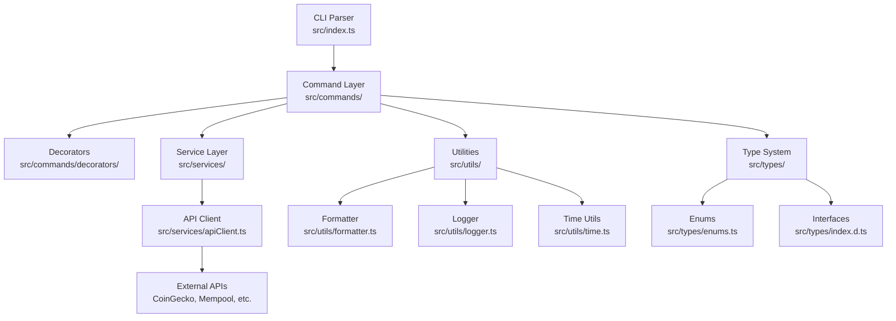
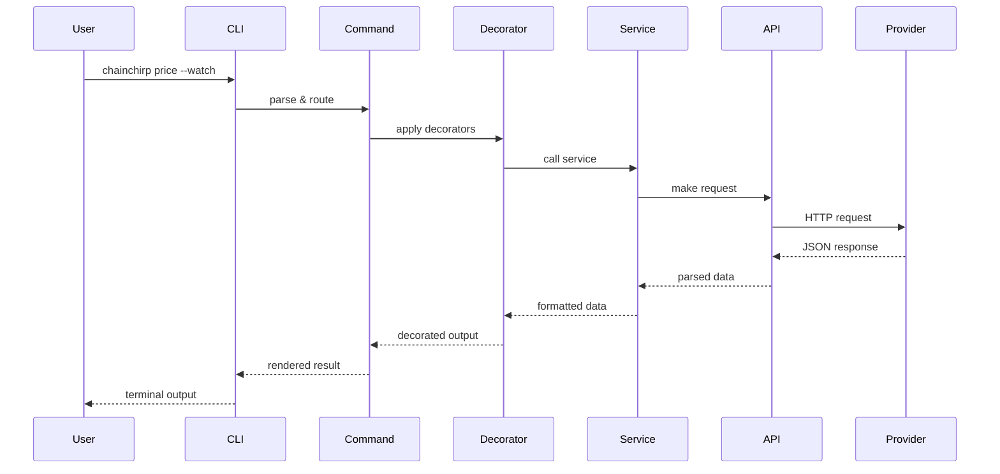
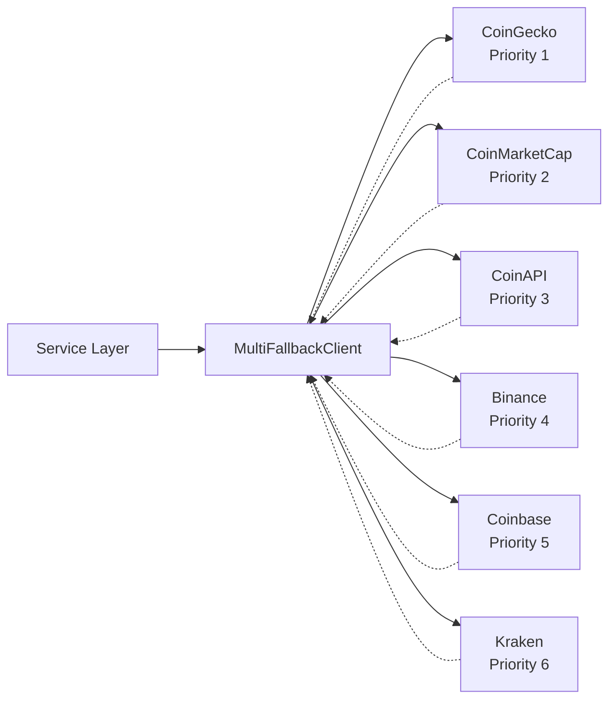
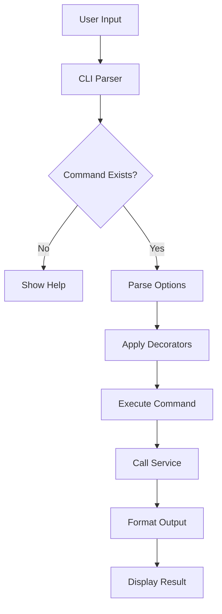
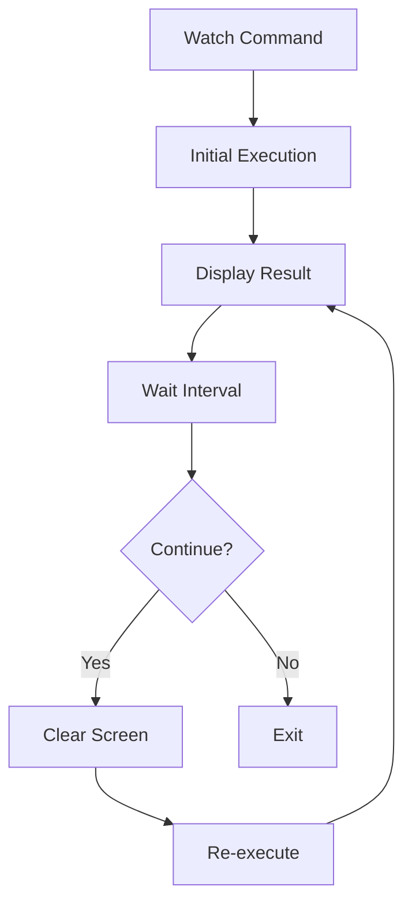
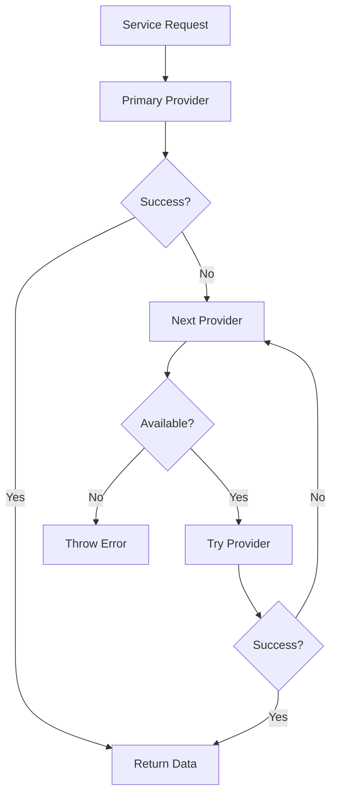
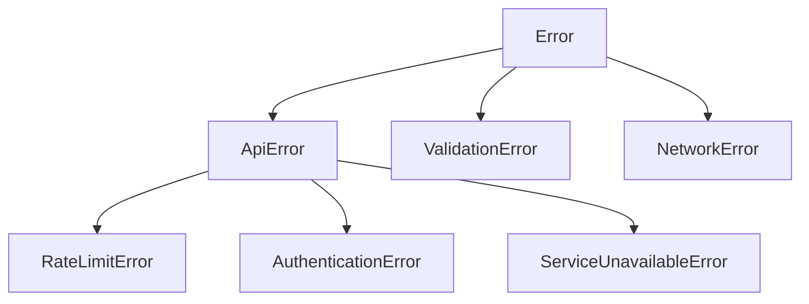
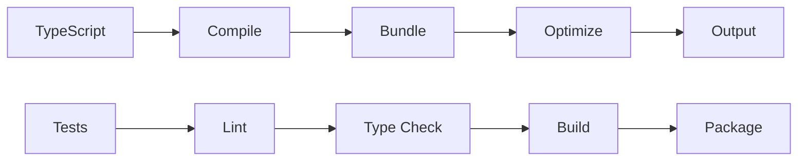

# Architecture

Understanding ChainChirp CLI's design, data flow, and component structure.

## High-Level Overview

ChainChirp CLI follows a layered architecture with clear separation of concerns:



## Request Flow



## Core Components

### 1. CLI Parser (`src/index.ts`)

The main entry point using CAC (Command and Control) library:

```typescript
// Simplified structure
const cli = cac('chainchirp')

// Global options
cli.option('--json', 'JSON output')
cli.option('--watch', 'Real-time updates')
cli.option('--currency <currency>', 'Display currency')

// Command registration
cli.command('price', 'Bitcoin price')
   .option('--detailed', 'Detailed view')
   .action(async (options) => {
     await marketCommands.price(options)
   })
```

### 2. Command Layer (`src/commands/`)

Commands are organized by domain:

```
src/commands/
├── market/           # Market data commands
│   ├── price.ts
│   ├── volume.ts
│   ├── change.ts
│   ├── highlow.ts
│   └── sparkline.ts
├── chain/            # Blockchain commands
│   ├── block.ts
│   ├── mempool.ts
│   ├── fees.ts
│   ├── hashrate.ts
│   └── halving.ts
└── decorators/       # Cross-cutting concerns
    ├── json.ts
    ├── watch.ts
    ├── currency.ts
    ├── help.ts
    └── version.ts
```

### 3. Decorator Pattern

Decorators add functionality to commands:

```typescript
// Example: JSON decorator
export function withJson<T>(
  commandFn: (options: T) => Promise<void>,
  formatter: JsonFormatter<T>
) {
  return async (options: T & JsonOptions) => {
    if (options.json) {
      const data = await commandFn(options)
      console.log(JSON.stringify(formatter(data), null, 2))
    } else {
      await commandFn(options)
    }
  }
}

// Usage
export const priceCommand = withJson(
  withWatch(
    withCurrency(basePriceCommand),
    priceWatchRenderer
  ),
  priceJsonFormatter
)
```

### 4. Service Layer (`src/services/`)

Services handle business logic and data fetching:

```
src/services/
├── apiClient.ts      # HTTP client with fallback
├── market/           # Market data services
│   ├── priceService.ts
│   ├── volumeService.ts
│   └── ...
└── chain/            # Chain data services
    ├── blockService.ts
    ├── feesService.ts
    └── ...
```

### 5. Multi-API Fallback System



## Data Flow Patterns

### 1. Command Execution



### 2. Watch Mode



### 3. API Fallback



## Type System

### Core Types

```typescript
// Market data types
interface MarketData {
  price: number
  currency: string
  change24h: number
  marketCap: number
  volume24h: number
  lastUpdated: Date
}

// Command options
interface BaseCommandOptions {
  currency?: Currency
  json?: boolean
  watch?: boolean
  interval?: number
}

// Service responses
interface CommandResult<T> {
  success: boolean
  data?: T
  error?: Error
  timestamp: Date
  executionTime: number
}
```

### Enums

```typescript
// Runtime enums for validation
enum OutputFormat {
  DEFAULT = 'default',
  JSON = 'json',
  TABLE = 'table'
}

enum CommandCategory {
  MARKET = 'market',
  CHAIN = 'chain',
  LIGHTNING = 'lightning'
}
```

## Error Handling

### Error Hierarchy



### Error Flow

```typescript
try {
  const data = await service.fetchData()
  return formatOutput(data)
} catch (error) {
  if (error instanceof ApiError) {
    // Try fallback provider
    return await fallbackService.fetchData()
  } else {
    // Log error and show user-friendly message
    logger.error('Command failed', error)
    console.error(chalk.red('✕ Command failed'))
    process.exit(1)
  }
}
```

## Performance Considerations

### 1. Caching Strategy

```typescript
interface CacheConfig {
  ttl: number          // Time to live in seconds
  maxSize: number      // Maximum cache entries
  compression: boolean // Compress cached data
}

const CACHE_CONFIG = {
  price: { ttl: 30, maxSize: 100 },
  volume: { ttl: 60, maxSize: 50 },
  blocks: { ttl: 600, maxSize: 20 }
}
```

### 2. Rate Limiting

```typescript
class RateLimiter {
  private requests: number[] = []
  private readonly windowMs: number
  private readonly maxRequests: number
  
  async checkLimit(): Promise<void> {
    // Sliding window rate limiting
    const now = Date.now()
    this.requests = this.requests.filter(
      time => now - time < this.windowMs
    )
    
    if (this.requests.length >= this.maxRequests) {
      const delay = this.calculateDelay()
      await this.sleep(delay)
    }
    
    this.requests.push(now)
  }
}
```

### 3. Response Transformation

```typescript
// Provider-specific response transformers
const transformers = {
  coingecko: (data: CoinGeckoResponse) => normalizeMarketData(data),
  binance: (data: BinanceResponse) => normalizeMarketData(data),
  coinbase: (data: CoinbaseResponse) => normalizeMarketData(data)
}

function normalizeMarketData(data: any): MarketData {
  return {
    price: extractPrice(data),
    currency: extractCurrency(data),
    change24h: extractChange(data),
    // ... other fields
  }
}
```

## Extension Points

### 1. Adding New Commands

```typescript
// 1. Create command file
// src/commands/market/newCommand.ts
export async function newCommand(options: NewCommandOptions) {
  // Implementation
}

// 2. Add to command registry
// src/commands/market/index.ts
export { newCommand } from './newCommand'

// 3. Register in CLI
// src/index.ts
cli.command('new', 'New command')
   .action(async (options) => {
     await marketCommands.newCommand(options)
   })
```

### 2. Adding New Decorators

```typescript
// src/commands/decorators/newDecorator.ts
export function withNewDecorator<T>(
  commandFn: (options: T) => Promise<void>,
  config: NewDecoratorConfig
) {
  return async (options: T & NewDecoratorOptions) => {
    // Pre-processing
    const result = await commandFn(options)
    // Post-processing
    return result
  }
}
```

### 3. Adding New Services

```typescript
// src/services/newService.ts
export class NewService {
  async fetchData(): Promise<ServiceData> {
    // Implementation
  }
}

// Register service
export const newService = new NewService()
```

## Testing Architecture

### Unit Tests

```
tests/
├── commands/         # Command tests
├── services/         # Service tests
├── utils/           # Utility tests
└── integration/     # Integration tests
```

### Test Patterns

```typescript
// Service tests
describe('PriceService', () => {
  it('should fetch price data', async () => {
    const mockClient = createMockClient()
    const service = new PriceService(mockClient)
    
    const result = await service.getPrice('usd')
    
    expect(result).toMatchObject({
      price: expect.any(Number),
      currency: 'usd'
    })
  })
})

// Command tests
describe('Price Command', () => {
  it('should display price', async () => {
    const mockService = createMockService()
    const consoleSpy = jest.spyOn(console, 'log')
    
    await priceCommand({ currency: 'usd' })
    
    expect(consoleSpy).toHaveBeenCalledWith(
      expect.stringContaining('Bitcoin Price')
    )
  })
})
```

## Build & Deployment

### Build Process



### Build Configuration

```typescript
// tsconfig.json
{
  "compilerOptions": {
    "target": "ES2022",
    "module": "ESNext",
    "moduleResolution": "node",
    "strict": true,
    "esModuleInterop": true,
    "skipLibCheck": true,
    "forceConsistentCasingInFileNames": true,
    "paths": {
      "@/*": ["./src/*"]
    }
  }
}
```

## Security Considerations

### 1. Input Validation

```typescript
// Validate all user inputs
function validateCurrency(currency: string): Currency {
  const valid = ['usd', 'eur', 'gbp', 'jpy', 'btc', 'eth', 'sats']
  if (!valid.includes(currency.toLowerCase())) {
    throw new ValidationError(`Invalid currency: ${currency}`)
  }
  return currency.toLowerCase() as Currency
}
```

### 2. API Key Management

```typescript
// Secure API key handling
const apiKey = process.env.API_KEY || 'DEMO_KEY'
if (apiKey === 'DEMO_KEY') {
  logger.warn('Using demo API key - rate limits apply')
}

// Don't log API keys
const sanitizedConfig = {
  ...config,
  apiKey: '***REDACTED***'
}
```

### 3. Rate Limiting & Abuse Prevention

```typescript
// Prevent abuse with rate limiting
const rateLimiter = new RateLimiter({
  windowMs: 60000,      // 1 minute
  maxRequests: 60,      // 60 requests per minute
  skipSuccessfulRequests: false
})
```

## Future Architecture Considerations

### Planned Enhancements

1. **Plugin System**: Allow third-party extensions
2. **Configuration Management**: Centralized config with validation
3. **Caching Layer**: Persistent cache with TTL
4. **Monitoring**: Built-in metrics and health checks
5. **Internationalization**: Multi-language support

### Scalability Patterns

```typescript
// Event-driven architecture for future scaling
interface EventBus {
  emit(event: string, data: any): void
  on(event: string, handler: (data: any) => void): void
}

// Modular command loading
const commandModules = await Promise.all([
  import('./commands/market'),
  import('./commands/chain'),
  import('./commands/lightning')
])
```

---

*This architecture supports the current CLI while being extensible for future growth and features.*